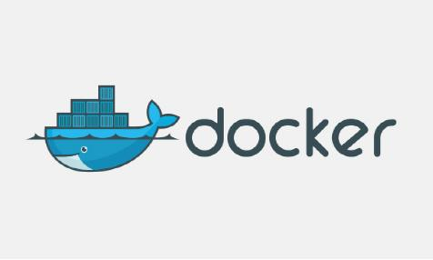
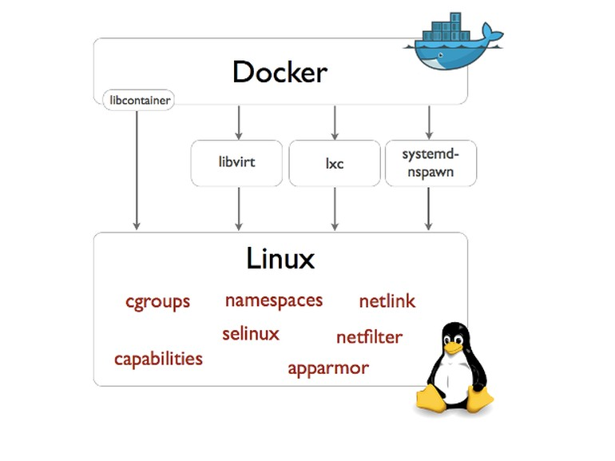

# Docker
## 1.Docker简介
### 1.1.Docker是什么?
> Docker的英文本意是“搬运工”，在程序员的世界里，Docker搬运的是集装箱（Container），集装箱里装的是任意类型的App，开发者通过Docker可以将App变成一种标准化的、可移植的、自管理的组件，可以在任何主流系统中开发、调试和运行。
>
> Docker 基于 Go 语言开发，代码托管在 Github 上，并遵循Apache 2.0 开源协议。Docker 容器可以封装任何有效负载，几乎可以在任何服务器之间进行一致性运行。换句话说，开发者构建的应用只需一次构建即可多平台运行。运营人员只需配置他们的服务，即可运行所有的应用。 
>
> Hyper-V、KVM和Xen等虚拟机管理程序都“基于虚拟化硬件仿真机制。这意味着，它们对系统要求很高.然而，容器却使用共享的操作系统。这意味着它们在使用系统资源方面比虚拟机管理程序要高效得多。容器不是对硬件进行虚拟化处理，而是驻留在一个Linux实例上。
>
> Docker可以解决虚拟机能够解决的问题，同时也能够解决虚拟机由于资源要求过高而无法解决的问题。



### 1.2.为什么要使用 docker ？

1. 快速交付应用程序

	- 开发者使用一个标准的 image 来构建开发容器，开发完成之后，系统管理员就可以使用这个容器来部署代码

	- docker 可以快速创建容器，快速迭代应用程序，并让整个过程可见，使团队中的其他成员更容易理解应用程序是如何创建和工作的。

	- docker 容器很轻！很快！容器的启动时间是秒级的，节约开发、测试、部署的时间

2. 更容易部署和扩展

	- docker 容器可以在几乎所有的环境中运行，物理机、虚拟机、公有云、私有云、个人电脑、服务器等等。

	- docker 容器兼容很多平台，这样就可以把一个应用程序从一个平台迁移到另外一个。

3. 效率更高

	- docker 容器不需要 hypervisor ，他是内核级的虚拟化。

4. 快速部署也意味着更简单的管理

	- 通常只需要小小的改变就可以替代以往巨型和大量的更新工作。


### 1.3.Docker的常用案例包括：

- 自动打包和部署应用
- 创建轻量、私有的 PaaS 环境
- 自动化测试和持续集成/部署
- 部署并扩展 Web 应用、数据库和后端服务器


下面的图片比较了 Docker 和传统虚拟化方式的不同之处，


可见容器是在操作系统层面上实现虚拟化，直接复用本地主机的操作系统，而传统方式则是在硬件层面实现。 

### 1.4.Docker优势

作为一种新兴的虚拟化方式，Docker 跟传统的虚拟化方式相比具有众多的优势。

首先，Docker 容器的启动可以在秒级实现，这相比传统的虚拟机方式要快得多。

其次，Docker 对系统资源的利用率很高，一台主机上可以同时运行数千个 Docker 容器。容器除了运行其中应用外，基本不消耗额外的系统资源，使得应用的性能很高，同时系统的开销尽量小。传统虚拟机方式运行 10 个不同的应用就要起 10 个虚拟机，而 Docker 只需要启动 10 个隔离的应用即可。

#### 1.4.1.具体说来，Docker 在如下几个方面具有较大的优势。

1. 更快速的交付和部署

> 对开发和运维（devop）人员来说，最希望的就是一次创建或配置，可以在任意地方正常运行。开发者可以使用一个标准的镜像来构建一套开发容器，开发完成之后，运维人员可以直接使用这个容器来部署代码。 Docker 可以快速创建容器，快速迭代应用程序，并让整个过程全程可见，使团队中的其他成员更容易理解应用程序是如何创建和工作的。 Docker 容器很轻很快！容器的启动时间是秒级的，大量地节约开发、测试、部署的时间。

2. 更高效的虚拟化

> Docker 容器的运行不需要额外的 hypervisor 支持，它是内核级的虚拟化，因此可以实现更高的性能和效率。

3. 更轻松的迁移和扩展

> Docker 容器几乎可以在任意的平台上运行，包括物理机、虚拟机、公有云、私有云、个人电脑、服务器等。这种兼容性可以让用户把一个应用程序从一个平台直接迁移到另外一个

4. 更简单的管理

> 使用 Docker，只需要小小的修改，就可以替代以往大量的更新工作。所有的修改都以增量的方式被分发和更新，从而实现自动化并且高效的管理。

#### 1.4.2.对比传统虚拟机总结

| 特性       | 容器               | 虚拟机   |
| ---------- | ------------------ | -------- |
| 启动       | 秒级               | 分钟级   |
| 硬盘使用   | 一般为MB           | 一般为GB |
| 性能       | 接近原生           | 弱于     |
| 系统支持量 | 单机支持上千个容器 |          |

 

## 2.Docker 的体系结构

### 2.1.Docker架构

Docker使用C/S 架构， docker daemon 作为 server 端接受 client 的请求，并处理（创建、运行、分发容器），他们可以运行在一个机器上，也通过 socket或者 RESTful API 通信


- Docker守护进程（Docker daemon）

如上图所示，Docker 守护进程运行在一台主机上。用户并不直接和守护进程进行交互，而是通过 Docker 客户端间接和其通信。docker daemon 一般在宿主主机后台运行。


- Docker客户端（Docker client）

Docker客户端，实际上是 docker 的二进制程序，是用户与 Docker 交互方式。它接收用户指令并且与背后的 Docker 守护进程通信。docker client以系统命令的形式存在，用户用 docker 命令来跟 docker daemon 交互。 

### 2.2.Docker内部构建

要理解 Docker 内部构建，需要理解以下三种部件：

- Docker镜像 - Docker images 
- Docker仓库 - Docker registeries 
- Docker容器 - Docker containers

#### 2.2.1.Docker 镜像 

Docker镜像是 Docker 容器运行时的只读模板，镜像可以用来创建 Docker 容器。每一个镜像由一系列的层 (layers) 组成。Docker 使用 UnionFS （联合文件系统）来将这些层联合到单独的镜像中。UnionFS 允许独立文件系统中的文件和文件夹(称之为分支)被透明覆盖，形成一个单独连贯的文件系统。正因为有了这些层的存在，Docker 是如此的轻量。当你改变了一个 Docker 镜像，比如升级到某个程序到新的版本，一个新的层会被创建。因此，不用替换整个原先的镜像或者重新建立(在使用虚拟机的时候你可能会这么做)，只是一个新的层被添加或升级了。现在你不用重新发布整个镜像，只需要升级，层使得分发 Docker 镜像变得简单和快速。

每个 docker 都有很多层次构成， docker 使用 union file systems  将这些不同的层结合到一个image 中去。

例如：centos镜像中安装MySQL 5.6，就成了nginx镜像”，其实在此时Docker镜像的层级概念就体现出来了。底层一个centos操作系统镜像，上面叠加一个ngnx层，就完成了一个nginx镜像的构建。层级概念就不难理解，此时我们一般centos操作系统镜像称为nginx镜像层的父镜像。


#### 2.2.2.Docker 仓库 

Docker 仓库用来保存镜像，可以理解为代码控制中的代码仓库。同样的，Docker 仓库也有公有和私有的概念。公有的 Docker 仓库名字是 Docker Hub。Docker Hub 提供了庞大的镜像集合供使用。这些镜像可以是自己创建，或者在别人的镜像基础上创建。

仓库是集中存放镜像文件的场所。有时候会把仓库和仓库注册服务器（Registry）混为一谈，并不严格区分。实际上，仓库注册服务器上往往存放着多个仓库，每个仓库中又包含了多个镜像，每个镜像有不同的标签（tag）。

仓库分为公开仓库（Public）和私有仓库（Private）两种形式。

最大的公开仓库是 Docker Hub，存放了数量庞大的镜像供用户下载。国内的公开仓库包括 Docker Pool等，可以提供大陆用户更稳定快速的访问。

当然，用户也可以在本地网络内创建一个私有仓库。

当用户创建了自己的镜像之后就可以使用push命令将它上传到公有或者私有仓库，这样下次在另外一台机器上使用这个镜像时候，只需要从仓库上pull下来就可以了。


> 注：Docker 仓库的概念跟 Git 类似，注册服务器可以理解为 GitHub 这样的托管服务。

#### 2.2.3.Docker 容器 

Docker利用容器来运行应用，一个Docker容器包含了所有的某个应用运行所需要的环境。每一个 Docker 容器都是从 Docker 镜像创建的。Docker 容器可以运行、开始、停止、移动和删除。每一个 Docker 容器都是独立和安全的应用平台。

容器是从镜像创建的运行实例。它可以被启动、开始、停止、删除。每个容器都是相互隔离的、保证安全的平台。

可以把容器看做是一个简易版的 Linux 环境（包括root用户权限、进程空间、用户空间和网络空间等）和运行在其中的应用程序。

> 注：镜像是只读的，容器在启动的时候创建一层可写层作为最上层。


与虚拟机相比，容器有一个很大的差异，它们被设计用来运行"单进程"，无法很好地模拟一个完整的环境。Docker设计者极力推崇“一个容器一个进程的方式”，如果你要选择在一个容器中运行多个进程，那唯一情况是：出于调试目的。

容器是设计来运行一个应用的，而非一台机器。你可能会把容器当虚拟机用，但你将失去很多的灵活性，因为Docker提供了用于分离应用与数据的工具，使得你可以快捷地更新运行中的代码/系统，而不影响数据。

Docker 从 0.9 版本开始使用libcontainer 替代 lxc，libcontainer和 Linux 系统的交互图如下： 



### 2.3.Docker 底层技术


docker底层的 2 个核心技术分别是 Namespaces 和 Control groups

Namespaces用来隔离各个容器


1. pid namespace

不同用户的进程就是通过 pid namespace 隔离开的，且不同 namespace  中可以有相同 pid 。所有的LXC 进程在 docker 中的父进程为 docker 进程，每个 lxc 进程具有不同的 namespace 。

2. net namespace

有了 pid namespace,  每个 namespace 中的 pid 能够相互隔离，但是网络端口还是共享 host 的端口。网络隔离是通过 net namespace 实现的，每个 net namespace 有独立的 network devices, IP addresses, IP routing tables, /proc/net  目录。这样每个 container 的网络就能隔离开来。 docker 默认采用 veth 的方式将 container 中的虚拟网卡同 host 上的一个 docker bridge: docker0 连接在一起。

3. ipc namespace

container中进程交互还是采用 linux 常见的进程间交互方法 (interprocess communication -IPC),包括常见的信号量、消息队列和共享内存。container  的进程间交互实际上还是host 上具有相同 pid namespace 中的进程间交互。

4. mnt namespace

类似 chroot ，将一个进程放到一个特定的目录执行。 mnt namespace 允许不同 namespace 的进程看到的文件结构不同，这样每个 namespace  中的进程所看到的文件目录就被隔离开了。在container里头，看到的文件系统，就是一个完整的linux系统，有/etc、/lib 等，通过chroot实现。

5. uts namespace

UTS("UNIXTime-sharing System") namespace 允许每个 container 拥有独立的 hostname 和 domain name,  使其在网络上可以被视作一个独立的节点而非 Host 上的一个进程。

6. user namespace

每个 container 可以有不同的 user  和 group id,  也就是说可以在 container 内部用 container 内部的用户执行程序而非 Host 上的用户。


有了以上 6 种 namespace 从进程、网络、IPC、文件系统、UTS 和用户角度的隔离，一个 container 就可以对外展现出一个独立计算机的能力，并且不同 container 从 OS 层面实现了隔离。然而不同 namespace 之间资源还是相互竞争的，仍然需要类似 ulimit 来管理每个 container 所能使用的资源 - -cgroup。

cgroups（Control groups）实现了对资源的配额和度量。

 

## 3.Docker 安装

docker官网：<https://docs.docker.com>

**Docker值得关注的特性：**

- 文件系统隔离：每个进程容器运行在一个完全独立的根文件系统里。
- 资源隔离：系统资源，像CPU和内存等可以分配到不同的容器中，使用cgroup。
- 网络隔离：每个进程容器运行在自己的网络空间，虚拟接口和IP地址。
- 日志记录：Docker将会收集和记录每个进程容器的标准流（stdout/stderr/stdin），用于实时检索或批量检索。


- 变更管理：容器文件系统的变更可以提交到新的映像中，并可重复使用以创建更多的容器。无需使用模板或手动配置。
- 交互式shell：Docker可以分配一个虚拟终端并关联到任何容器的标准输入上，

### 3.1.CentOS系列安装 Docker，Docker 支持 CentOS6 及以后的版本。

#### 3.1.1.CentOS6：

在RedHat/CentOS环境下安装Docker。官方文档要求Linux kernel至少3.8以上，且docker只能运行在64位的系统中。由于RHEL6和CentOS6的内核版本为2.6，因此必须要先升级内核。

1. 升级内核（记住一定要升级，要不然会出现很多莫名奇怪的问题，建议用yum安装）

​     yum安装带aufs模块的3.10内核

```bash
[root@localhost ~]# cd /etc/yum.repos.d
[root@localhost ~]# wget http://www.hop5.in/yum/el6/hop5.repo
[root@localhost ~]# yum install kernel-ml-aufs kernel-ml-aufs-devel
```

2. 修改grub的主配置文件/etc/grub.conf，设置default=0，表示第一个title下的内容为默认启动的kernel（一般新安装的内核在第一个位置），重启系统，这时候你的内核就成功升级了。
```bash
[root@localhost ~]# uname -r
3.10.5-3.el6.x86_64
```
 查看内核是否支持aufs：
```bash
[root@localhost ~]# grep aufs /proc/filesystems
nodev    aufs
```
对于 CentOS6，可以使用 EPEL 库安装 Docker，命令如下：
```bash
[root@localhost ~][root@localhost ~]# yum -y install http://mirrors.yun-idc.com/epel/6/i386/epel-release-6-8.noarch.rpm
[root@localhost ~]# yum -y install docker-io
```
启动docker服务
```bash
[root@localhost ~]# service docker start
```

#### 3.1.2.CentOS7：

Prerequisites（先决条件）

Docker requires a 64-bit installation regardless of your CentOSversion. Also, your kernel must be 3.10 at minimum, which CentOS 7 runs.

无论你的CentOS版本如何，Docker都需要64位的安装环境。另外，你运行的CentOS 7的内核至少也是3.10。

To check your current kernel version, open a terminal and use `uname -r` to display your kernelversion.

如果要查看你当前的内核版本，请打开终端并使用`uname -r`显示内核版本。

```bash
[root@localhost Desktop]# uname -r
3.10.0-327.el7.x86_64
```

##### 3.1.2.1.使用CentOS提供的软件源安装

Docker软件包已经包括在默认的 CentOS-Extras 软件源里。因此想要安装 docker，只需要运行下面的 yum 命令：

```bash
[root@localhost ~]# yum -y install docker
Loaded plugins: fastestmirror, langpacks
Loading mirror speeds from cached hostfile
 * base: mirror.bit.edu.cn
 * extras: mirrors.aliyun.com
 * updates: mirrors.aliyun.com
 
 ······
 
Installed:
  docker.x86_64 2:1.13.1-53.git774336d.el7.centos  
  
 ······
  
Complete!
```
启动 Docker 服务：

安装完成后，使用下面的命令来启动 docker 服务，并将其设置为开机启动：

```bash
[root@localhost ~]# service docker start
Redirecting to /bin/systemctl start  docker.service
Job for docker.service failed because the control process exited with error code. See "systemctl status docker.service" and "journalctl -xe" for details.
```

根据提示信息查看：

```bash
[root@localhost ~]# systemctl status docker
● docker.service - Docker Application Container Engine
   Loaded: loaded (/usr/lib/systemd/system/docker.service; disabled; vendor preset: disabled)
   Active: failed (Result: exit-code) since Wed 2018-04-25 11:36:01 CST; 10s ago
     Docs: http://docs.docker.com
  Process: 18184 ExecStart=/usr/bin/dockerd-current --add-runtime docker-runc=/usr/libexec/docker/docker-runc-current --default-runtime=docker-runc --exec-opt native.cgroupdriver=systemd --userland-proxy-path=/usr/libexec/docker/docker-proxy-current --seccomp-profile=/etc/docker/seccomp.json $OPTIONS $DOCKER_STORAGE_OPTIONS $DOCKER_NETWORK_OPTIONS $ADD_REGISTRY $BLOCK_REGISTRY $INSECURE_REGISTRY $REGISTRIES (code=exited, status=1/FAILURE)
 Main PID: 18184 (code=exited, status=1/FAILURE)

Apr 25 11:36:00 localhost systemd[1]: Starting Docker Application Container Engine...
Apr 25 11:36:00 localhost dockerd-current[18184]: time="2018-04-25T11:36:00.046979153+08:00" level=warning msg="could not change group /var/run/docker.sock to docker: group docker not found"
Apr 25 11:36:00 localhost dockerd-current[18184]: time="2018-04-25T11:36:00.050516415+08:00" level=info msg="libcontainerd: new containerd process, pid: 18191"
Apr 25 11:36:01 localhost dockerd-current[18184]: time="2018-04-25T11:36:01.159608823+08:00" level=warning msg="overlay2: the backing xfs filesystem is formatted without d_type support, wh...
Apr 25 11:36:01 localhost dockerd-current[18184]: Error starting daemon: SELinux is not supported with the overlay2 graph driver on this kernel. Either boot into a newer kernel...abled=false)
Apr 25 11:36:01 localhost systemd[1]: docker.service: main process exited, code=exited, status=1/FAILURE
Apr 25 11:36:01 localhost systemd[1]: Failed to start Docker Application Container Engine.
Apr 25 11:36:01 localhost systemd[1]: Unit docker.service entered failed state.
Apr 25 11:36:01 localhost systemd[1]: docker.service failed.
Hint: Some lines were ellipsized, use -l to show in full.

```

```bash
[root@localhost ~]# journalctl -xe
-- Support: http://lists.freedesktop.org/mailman/listinfo/systemd-devel
-- 
-- Unit docker-storage-setup.service has begun starting up.
Apr 25 11:42:45 localhost systemd[1]: Started Docker Storage Setup.
-- Subject: Unit docker-storage-setup.service has finished start-up
-- Defined-By: systemd
-- Support: http://lists.freedesktop.org/mailman/listinfo/systemd-devel
-- 
-- Unit docker-storage-setup.service has finished starting up.
-- 
-- The start-up result is done.
Apr 25 11:42:45 localhost systemd[1]: Starting Docker Application Container Engine...
-- Subject: Unit docker.service has begun start-up
-- Defined-By: systemd
-- Support: http://lists.freedesktop.org/mailman/listinfo/systemd-devel
-- 
-- Unit docker.service has begun starting up.
Apr 25 11:42:45 localhost dockerd-current[18421]: time="2018-04-25T11:42:45.320039836+08:00" level=info msg="libcontainerd: new containerd process, pid: 18428"
Apr 25 11:42:46 localhost dockerd-current[18421]: time="2018-04-25T11:42:46.351628517+08:00" level=warning msg="overlay2: the backing xfs filesystem is formatted without d_type support, which
Apr 25 11:42:46 localhost dockerd-current[18421]: Error starting daemon: SELinux is not supported with the overlay2 graph driver on this kernel. Either boot into a newer kernel or disable sel
Apr 25 11:42:46 localhost systemd[1]: docker.service: main process exited, code=exited, status=1/FAILURE
Apr 25 11:42:46 localhost systemd[1]: Failed to start Docker Application Container Engine.
-- Subject: Unit docker.service has failed
-- Defined-By: systemd
-- Support: http://lists.freedesktop.org/mailman/listinfo/systemd-devel
-- 
-- Unit docker.service has failed.
-- 
-- The result is failed.
Apr 25 11:42:46 localhost systemd[1]: Unit docker.service entered failed state.
Apr 25 11:42:46 localhost systemd[1]: docker.service failed.
Apr 25 11:42:46 localhost polkitd[987]: Unregistered Authentication Agent for unix-process:18366:489010 (system bus name :1.130, object path /org/freedesktop/PolicyKit1/AuthenticationAgent, l
```

根据上边的提示，会发现有一个错误：

> Apr 25 11:42:46 localhost dockerd-current[18421]: Error starting daemon: SELinux is not supported with the overlay2 graph driver on this kernel. Either boot into a newer kernel or disable sel

这句话提示的是：SELinux不支持这个内核上带有 overlay2的图形驱动，说白了就是SELinux有问题，兼容性差，那么我们要做的就是关闭SELinux。

```bash
[root@localhost ~]# vi /etc/sysconfig/selinux 

# This file controls the state of SELinux on the system.
# SELINUX= can take one of these three values:
#     enforcing - SELinux security policy is enforced.
#     permissive - SELinux prints warnings instead of enforcing.
#     disabled - No SELinux policy is loaded.
SELINUX=enforcing
# SELINUXTYPE= can take one of three two values:
#     targeted - Targeted processes are protected,
#     minimum - Modification of targeted policy. Only selected processes are protected.
#     mls - Multi Level Security protection.
SELINUXTYPE=targeted

```

将`SELINUX=enforcing`改为`SELINUX=disabled`，然后重启系统即可。

可以使用`getenforce`查看SELinux的当前状态

```bash
[root@localhost ~]# getenforce 
Disabled
```

注：临时关闭SELinux并不能解决此问题。

可以是用`setenforce 0`临时关闭SELinux：

```bash
[root@localhost ~]# setenforce 0
```

然后再次启动：

```bash
[root@localhost ~]# systemctl  start docker.service
[root@localhost ~]# systemctl  enable docker.service
Created symlink from /etc/systemd/system/multi-user.target.wants/docker.service to /usr/lib/systemd/system/docker.service.
```

也可以使用旧式烦人sysv语法，命令如下：

```bash
[root@localhost ~]# service docker start
[root@localhost ~]# chkconfig docker on
```

查看docker版本  

```bash
[root@localhost ~]# docker version 
Client:
 Version:         1.13.1
 API version:     1.26
 Package version: <unknown>
 Go version:      go1.8.3
 Git commit:      774336d/1.13.1
 Built:           Wed Mar  7 17:06:16 2018
 OS/Arch:         linux/amd64

Server:
 Version:         1.13.1
 API version:     1.26 (minimum version 1.12)
 Package version: <unknown>
 Go version:      go1.8.3
 Git commit:      774336d/1.13.1
 Built:           Wed Mar  7 17:06:16 2018
 OS/Arch:         linux/amd64
 Experimental:    false
```
查看docker详细信息：

```bash
[root@localhost ~]# docker info
Containers: 0
 Running: 0
 Paused: 0
 Stopped: 0
Images: 0
Server Version: 1.13.1
Storage Driver: overlay2
 Backing Filesystem: xfs
 Supports d_type: false
 Native Overlay Diff: false
Logging Driver: journald
Cgroup Driver: systemd
Plugins: 
 Volume: local
 Network: bridge host macvlan null overlay
Swarm: inactive
Runtimes: docker-runc runc
Default Runtime: docker-runc
Init Binary: docker-init
containerd version:  (expected: aa8187dbd3b7ad67d8e5e3a15115d3eef43a7ed1)
runc version: N/A (expected: 9df8b306d01f59d3a8029be411de015b7304dd8f)
init version: N/A (expected: 949e6facb77383876aeff8a6944dde66b3089574)
Security Options:
 seccomp
  WARNING: You're not using the default seccomp profile
  Profile: /etc/docker/seccomp.json
Kernel Version: 3.10.0-327.el7.x86_64
Operating System: CentOS Linux 7 (Core)
OSType: linux
Architecture: x86_64
Number of Docker Hooks: 3
CPUs: 4
Total Memory: 3.845 GiB
Name: localhost
ID: AWTT:G7HR:3HDL:YCAT:CF7U:RMJH:Z54D:VTLY:MIDU:7FTB:CZYZ:DPB5
Docker Root Dir: /var/lib/docker
Debug Mode (client): false
Debug Mode (server): false
Registry: https://index.docker.io/v1/
WARNING: bridge-nf-call-iptables is disabled
WARNING: bridge-nf-call-ip6tables is disabled
Experimental: false
Insecure Registries:
 127.0.0.0/8
Live Restore Enabled: false
Registries: docker.io (secure)
```

##### 3.1.2.2.使用docker官方提供的软件源安装（官方文档安装方法）

1. Log into your machine as a user with `sudo` or `root` privileges.
   使用有`root`或者`sudo`权限的用户登录你的机器
2. Make sure your existing yumpackages are up-to-date.
   确定你现有的yum源安装包已经更新
3. Add the yum repo
   添加yum源

```bash
[root@localhost ~]# tee /etc/yum.repos.d/docker.repo <<-'EOF'
[dockerrepo] 
name=DockerRepository
baseurl=https://yum.dockerproject.org/repo/main/centos/7/
enabled=1
gpgcheck=1
gpgkey=https://yum.dockerproject.org/gpg
EOF
```

> 注：如果我们既想把输出保存到文件中，又想在屏幕上看到输出内容，就可以使用tee命令了。tee命令读取标准输入，把这些内容同时输出到标准输出和（多个）文件中

效果如下：

```bash
[root@localhost ~]# cat /etc/yum.repos.d/docker.repo 
[dockerrepo] 
name=DockerRepository
baseurl=https://yum.dockerproject.org/repo/main/centos/7/
enabled=1
gpgcheck=1
gpgkey=https://yum.dockerproject.org/gpg
```

如果不想使用tee命令，也可以直接编辑`docker.repo`文件，添加上述内容即可。

4. Install the Docker package
   安装docker包

   ```bash
   [root@localhost ~]# yum -y install docker-engine
   Loaded plugins: fastestmirror, langpacks
   base                                                                                                                         | 3.6 kB  00:00:00     
   dockerrepo                                                                                                                   | 2.9 kB  00:00:00     
   extras                                                                                                                       | 3.4 kB  00:00:00     
   updates                                                                                                                      | 3.4 kB  00:00:00     
   (1/2): base/7/x86_64/group_gz                                                                                                | 156 kB  00:00:00     
   (2/2): dockerrepo/primary_db                                                                                                 |  34 kB  00:00:01     
   Determining fastest mirrors
    * base: mirrors.aliyun.com
    * extras: mirrors.aliyun.com
    * updates: mirrors.aliyun.com
   Resolving Dependencies

    ······

   Installed:
     docker-engine.x86_64 0:17.05.0.ce-1.el7.centos
     
    ······
    
    Complete!
   ```

5. Start the Docker daemon.
   启动docker进程

   ```bash
   [root@localhost ~]# systemctl start docker.service
   ```


6. Verify `docker` is installed correctly by running a test image in a container.
   通过在容器里运行一个测试镜像来验证docker是否安装正确

   ```bash
   [root@localhost ~]# docker run hello-world
   Unable to find image 'hello-world:latest' locally
   latest: Pulling from library/hello-world
   9bb5a5d4561a: Pull complete 
   Digest: sha256:f5233545e43561214ca4891fd1157e1c3c563316ed8e237750d59bde73361e77
   Status: Downloaded newer image for hello-world:latest

   Hello from Docker!
   This message shows that your installation appears to be working correctly.

   To generate this message, Docker took the following steps:
    1. The Docker client contacted the Docker daemon.
    2. The Docker daemon pulled the "hello-world" image from the Docker Hub.
       (amd64)
    3. The Docker daemon created a new container from that image which runs the
       executable that produces the output you are currently reading.
    4. The Docker daemon streamed that output to the Docker client, which sent it
       to your terminal.

   To try something more ambitious, you can run an Ubuntu container with:
    $ docker run -it ubuntu bash

   Share images, automate workflows, and more with a free Docker ID:
    https://hub.docker.com/

   For more examples and ideas, visit:
    https://docs.docker.com/engine/userguide/
    
   ```

   Docker  默认使用的是 unix socket，可以使用一下命令查看docker进程

   ```bash
   [root@localhost ~]# netstat -ax | grep docker
   unix  2      [ ACC ]     STREAM     LISTENING     47412    /var/run/docker/libcontainerd/docker-containerd.sock
   unix  2      [ ACC ]     STREAM     LISTENING     48262    /var/run/docker.sock
   unix  2      [ ACC ]     STREAM     LISTENING     48325    /run/docker/libnetwork/1977701ced3dae77bd1b9451c66875a15bcda93e15f98c3ab5a86beca6704302.sock
   unix  3      [ ]         STREAM     CONNECTED     57457    /var/run/docker/libcontainerd/docker-containerd.sock
   ```

   > 注：直接输入docker命令来查看所有的Options和Commands，查看某一个command的详细使用方法：docker COMMAND --help

## 4.Docker镜像

在之前的介绍中，我们知道 docker images 是 docker 的三大组件之一。

Docker 把下载的 images 存储到 docker 主机上，如果一个 image 不在主机上， docker 会从一个镜像仓库下载，默认的仓库是 `DOCKER HUB` 公共仓库。

接下来将介绍更多关于 docker images 的内容，包括：

- 列出本地主机上已经存在的 images
- 获取images
- 使用和管理本地主机上的 images
- 创建一个基础的 images
- 上传 images 到 docker hub （公共 images 仓库）

## 4.1 查看本地镜像

可以使用`docker images`列出本地所有镜像

```bash
[root@localhost ~]# docker images
REPOSITORY          TAG                 IMAGE ID            CREATED             SIZE
hello-world         latest              e38bc07ac18e        4 weeks ago         1.85kB
centos              centos7             e934aafc2206        5 weeks ago         199MB
```

在列出信息中，

- REPOSITORY:来自于哪个仓库，比如 centos
- TAG：标记，比如  latest。一个仓库可能有一个 images 的多个发行版，比如 ubuntu ，他们有 10.04 12.04 12.10 13.04 14.04,每个发行版的标记都不同，可以使用 tag 命令来指定 images。latest是在下载镜像时没有指定具体的发行版，比如仅使用 ubuntu ，那么 docker 会使用最新的发行版 ubuntu:latest，所以建议最好指定发行版，只有这样你才可以保证你真正使用的 image 是那个
- IMAGE ID:镜像它的 ID 号
- CREATED:创建时间
- SIZE:镜像的大小

## 4.2 查找镜像

docker 的一个好处是很多人会因为各种不同的用途创建了各种不同的 images ，而且它们大部分都被上传到了docker hub 共有仓库上，以便其他人使用。我们可以使用`docker search`命令在 docker hub 的网站上来查找它们。比如，当我们需要nginx作为 web 应用程序的开发时，我们使用 docker search  来搜索合适的image ，使用关键字 nginx。

> docker search *keyword*


我们看到返回了很多包含 nginx 的 images 。其中包括 image 名字、描述、星级（表示该 image 的受欢迎程度）、是否官方创建、是否自动创建。官方的 images 是 stackbrew 项目组创建和维护的，automated  资源允许你验证 image 的来源和内容。

到目前为止，我们看到了 2种 images  资源。比如 centos ，被称为基础或则根镜像。这些基础镜像是 docker 公司创建、验证、支持、提供。他们往往使用一个单词作为他们的名字。还有一种类型，比如我们选择的 jwilder/nginx-proxy 镜像。它是由 docker 的用户创建并维护的，你可以通过指定 image 名字的前缀来指定他们，比如 jwilder 。