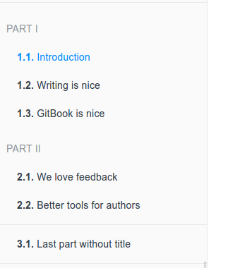
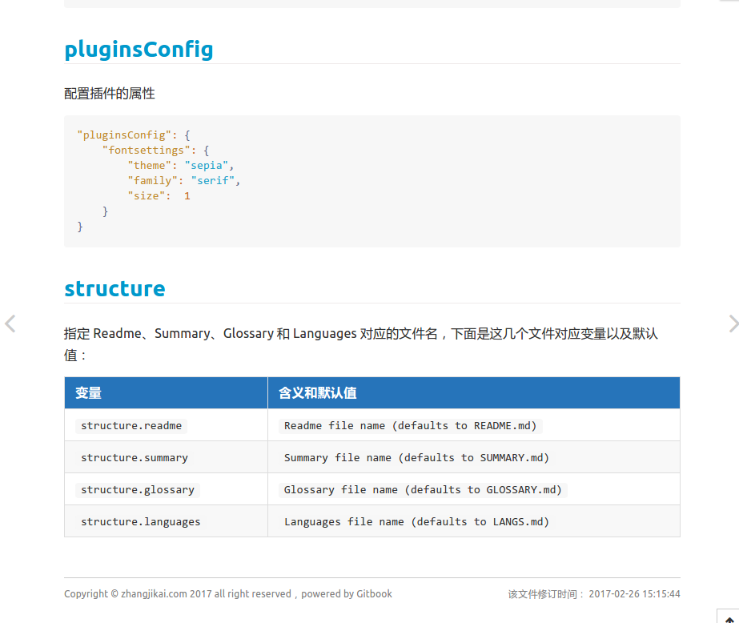
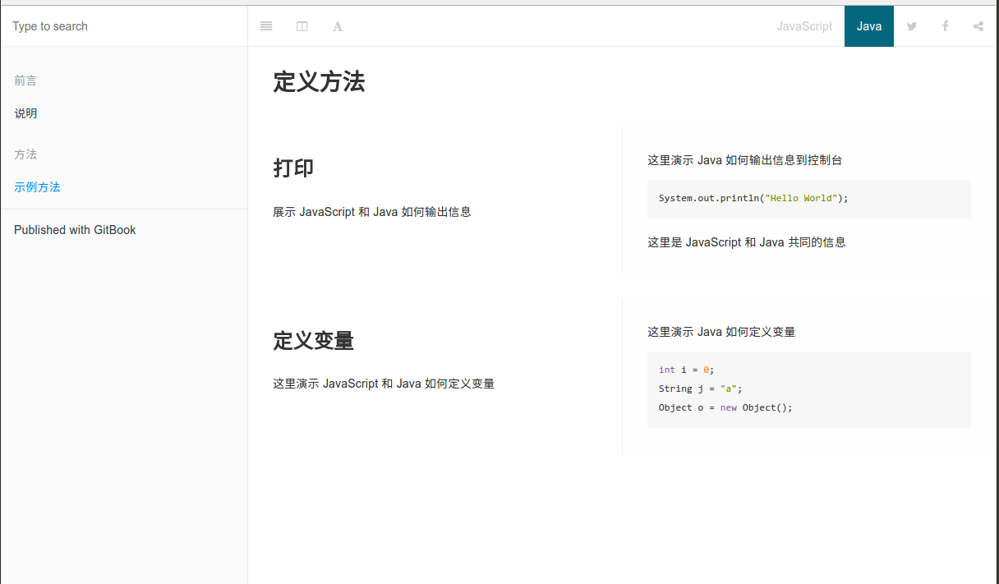
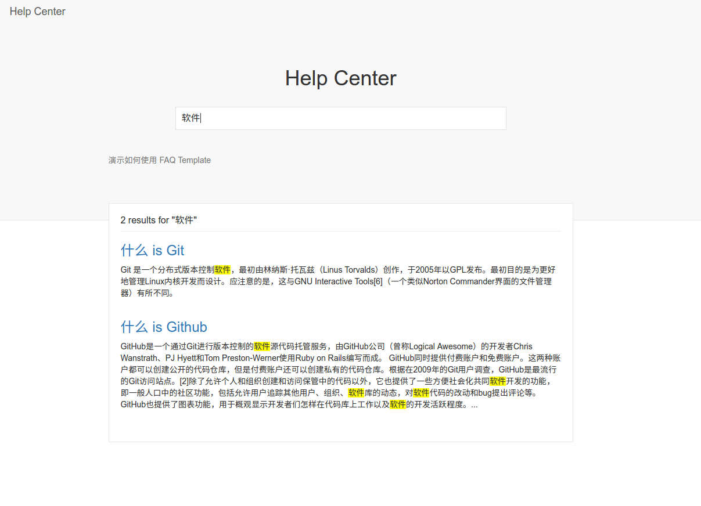

# Gitbook

## 1.简介 

[GitBook](https://baike.so.com/doc/25753246-26887136.html#refff_25753246-26887136-1) 是一个基于 [Node.js](https://baike.so.com/doc/4308655-4512592.html) 的命令行工具，可使用 [Github](https://baike.so.com/doc/5414728-5652870.html)/[Git](https://baike.so.com/doc/941204-7765041.html) 和 [Markdown](https://baike.so.com/doc/6949586-7171987.html) 来制作精美的电子书，GitBook 并非关于 Git 的教程。

GitBook支持输出多种文档格式:

- 静态站点:GitBook默认输出该种格式，生成的静态站点可直接托管搭载Github Pages服务上;
- [PDF](https://baike.so.com/doc/5369441-5605294.html):需要安装gitbook-pdf依赖;
- [eBook](https://baike.so.com/doc/6708731-6922747.html):需要安装ebook-convert;
- 单[HTML](https://baike.so.com/doc/5869876-6082735.html)网页:支持将内容输出为单页的HTML，不过一般用在将电子书格式转换为PDF或eBook的中间过程;
- [JSON](https://baike.so.com/doc/663437-702310.html):一般用于电子书的调试或元数据提取。

使用GitBook制作电子书，必备两个文件:*README.md*和*SUMMARY.md*

## 2.安装

### 2.1.准备环境

- [Nodejs](/Data/Nodejs.md)（v4.0.0及以上）最好是最新的LTS版本

### 2.2.NPM安装gitbook

运行下面的命令安装

```bash
npm install gitbook-cli -g
```

其中`gitbook-cli`是gitbook的一个命令行工具, 通过它可以在电脑上安装和管理gitbook的多个版本。

### 2.3.编辑书籍

gitbook 官方已经提供了一个本地的[编辑器](https://www.gitbook.com/editor/osx), 使用它可以方便的编写书籍(不需要手动的写SUMMARY.md), 并且支持windows、mac、linux 三种平台,对于新手来说是一个福音，但是本人还是偏向于使用命令行编辑。

### 2.4.预览书籍
使用下列命令会运行一个服务器, 通过`http://localhost:4000/`可以预览书籍
```bash
gitbook serve
```
运行该命令后会在书籍的文件夹中生成一个 `_book` 文件夹, 里面的内容即为生成的 html 文件.
我们可以使用下面命令来生成网页而不开启服务器
```bash
gitbook build
```
## 3.命令

这里主要介绍一下 GitBook 的命令行工具 `gitbook-cli` 的一些命令, 首先说明两点:

* `gitbook-cli` 和 `gitbook` 是两个软件
* `gitbook-cli` 会将下载的 gitbook 的不同版本放到 `~/.gitbook`中, 可以通过设置`GITBOOK_DIR`环境变量来指定另外的文件夹


### 3.1.列出gitbook所有的命令

```bash
gitbook help
```

### 3.2.输出`gitbook-cli`的帮助信息
```bash
gitbook --help
```

### 3.3.生成静态网页
```bash
gitbook build
```

### 3.4.生成静态网页并运行服务器
```bash
gitbook serve
```

### 3.5.生成时指定gitbook的版本, 本地没有会先下载
```bash
gitbook build --gitbook=2.0.1
```

### 3.6.列出本地所有的gitbook版本
```bash
gitbook ls
```

### 3.7.列出远程可用的gitbook版本
```bash
gitbook ls-remote
```

### 3.8.安装对应的gitbook版本
```bash
gitbook fetch 标签/版本号
```

### 3.9.更新到gitbook的最新版本
```bash
gitbook update
```

### 3.10.卸载对应的gitbook版本
```bash
gitbook uninstall 2.0.1
```

### 3.11.指定log的级别
```bash
gitbook build --log=debug
```

### 3.12.输出错误信息
```bash
gitbook builid --debug
```
## 4.目录结构

### 4.1.GitBook 基本的目录结构如下所示

```
.
├── book.json
├── README.md
├── SUMMARY.md
├── chapter-1/
|   ├── README.md
|   └── something.md
└── chapter-2/
    ├── README.md
    └── something.md
```
这里主要讲下 GitBook 预定义的几个文件的作用
### 4.2. book.json
存放配置信息，在gitbook中所有的配置信息都是在这个文件里定义的，关于该文件的配置可以看[配置](Gitbook.md#配置)这部分。

### 4.3. Summary
概要文件主要存放 GitBook 的文件目录信息，左侧的目录就是根据这个文件来生成的，默认对应的文件是 `SUMMARY.md`，可以在 `book.json` 重新定义该文件的对应值。它通过 Markdown 中的列表语法来表示文件的父子关系，下面是一个简单的示例：
```
# Summary
* [Introduction](README.md)
* [Part I](part1/README.md)
    * [Writing is nice](part1/writing.md)
    * [GitBook is nice](part1/gitbook.md)
* [Part II](part2/README.md)
    * [We love feedback](part2/feedback_please.md)
    * [Better tools for authors](part2/better_tools.md)
```
这个配置对应的目录结构如下所示:


我们通过使用 标题 或者 水平分割线 标志将 GitBook 分为几个不同的部分
```
# Summary

### Part I

* [Introduction](README.md)
* [Writing is nice](part1/writing.md)
* [GitBook is nice](part1/gitbook.md)

### Part II

* [We love feedback](part2/feedback_please.md)
* [Better tools for authors](part2/better_tools.md)

----

* [Last part without title](part3/title.md)
```
这个配置对应的目录结构如下所示：



### 4.4. Glossary
词汇表文件，默认对应的文件是 `GLOSSARY.md`。该文件主要存储词汇信息，如果在其他页面中出现了该文件中的词汇，鼠标放到词汇上会给出词汇示意，可以将鼠标移到下面两个词汇上看下效果。

Git &nbsp;&nbsp; Markdown

Glossary 文件的格式如下所示：
```
## Git
分散式版本控制软件

## Markdown
Aaron Swartz 跟John Gruber共同设计的排版语言
```
## 5.配置

记录Gitbook的一些配置信息

* [title - 标题](#title)
* [author - 作者信息](#author)
* [description - 书本描述](#description)
* [language - 使用的语言](#language)
* [gitbook - 指定gitbook版本](#gitbook)
* [root - 指定存放 GitBook 文件的根目录](#root)
* [links - 在侧边栏添加链接](#links)
* [styles - 自定义样式](#styles)
* [plugins - 插件](#plugins)
* [pluginsConfig - 插件配置](#pluginsconfig)
* [structure - 设置 Readme, Summary, Glossary等对应的文件](#structure)

### 5.1.title
设置书本的标题
```json
"title" : "My Book"
```

### 5.2.author
作者的相关信息
```json
"author" : "Yansm"
```

### 5.3.description
本书的简单描述
```json
"description" : "记录Gitbook的配置和一些插件的使用"
```

### 5.4.language
Gitbook使用的语言, 版本2.6.4中可选的语言如下：
```
en, ar, bn, cs, de, en, es, fa, fi, fr, he, it, ja, ko, no, pl, pt, ro, ru, sv, uk, vi, zh-hans, zh-tw
```
配置使用简体中文
```
"language" : "zh-hans",
```
### 5.5.gitbook
指定使用的gitbook版本
```json
"gitbook" : "3.2.2",
"gitbook" : ">=3.0.0"
```
### 5.6.root
指定存放 GitBook 文件（除了 book.json）的根目录
```json
"root": "."
```
### 5.7.links
在左侧导航栏添加链接信息
```json
"links" : {
    "sidebar" : {
        "Home" : "http://localhost:4000"
    }
}
```

### 5.8.styles
自定义页面样式， 默认情况下各generator对应的css文件
```json
"styles": {
    "website": "styles/website.css",
    "ebook": "styles/ebook.css",
    "pdf": "styles/pdf.css",
    "mobi": "styles/mobi.css",
    "epub": "styles/epub.css"
}
```
例如使`<h1> <h2>`标签有下边框， 可以在`website.css`中设置
```css
h1 , h2{
    border-bottom: 1px solid #EFEAEA;
}

```
### 5.9.plugins
配置使用的插件
```json
"plugins": [
    "disqus"
]
```
添加新插件之后需要运行`gitbook install`来安装新的插件  

Gitbook默认带有5个插件：
* highlight
* search
* sharing
* font-settings
* livereload

如果要去除自带的插件， 可以在插件名称前面加`-`
```json
"plugins": [
    "-search"
]
```
### 5.10.pluginsConfig
配置插件的属性
```json
"pluginsConfig": {
    "fontsettings": {
        "theme": "sepia",
        "family": "serif",
        "size":  1
    }
}
```
### 5.11.structure
指定 Readme、Summary、Glossary 和 Languages 对应的文件名，下面是这几个文件对应变量以及默认值：

| 变量                  | 含义和默认值                                   |
| :-------------------- | :--------------------------------------------- |
| `structure.readme`    | `Readme file name (defaults to README.md)`     |
| `structure.summary`   | `Summary file name (defaults to SUMMARY.md)`   |
| `structure.glossary`  | `Glossary file name (defaults to GLOSSARY.md)` |
| `structure.languages` | `Languages file name (defaults to LANGS.md)`   |

## 6.主题


目前 GitBook 提供了三类文档： Book 文档、API文档、FAQ文档。我们常用的就是 Book 文档模式，如果我们需要使用 API 文档模式或者 FAQ 文档模式，只需引入文档对应的主题插件即可，下面我们介绍与这三类文档相关的主题插件。

### 6.1Book
Book 是我们常用的模式，大部分插件也都是针对这个模式做的。下面介绍一下针对 Book 模式的两个主题。
#### 6.1.1.theme-default
`theme-default` 是默认的 Book 主题。将 `showLevel` 设为 `true`， 就可以显示标题前面的数字索引，默认不显示。
```json
{
    "theme-default": {
        "showLevel": true
    }
}
```
在使用该主题的过程中，发现经常会在控制台报下面的错误，没有找到是哪里的原因，官方也一直没有修复。
```
theme.js:4 Uncaught TypeError: Cannot read property 'split' of undefined
```
后来在 [这里](https://github.com/maxkoryukov/theme-default/commit/811fcca17fcc84ad9ff3f940a4194dbffa62a31d) 看到一个解决方法，需要修改本地的 GitBook Theme 模板。下面是具体步骤：
* 进入 GitBook 默认主题所在的文件夹 `用户主目录` -> `.gitbook` -> `versions` -> `3.2.2` -> `node_modules` -> `gitbook-plugin-theme-default` -> `src` -> `js` -> `theme`，打开 `navigation.js`，找到 `getChapterHash` 函数
```js
function getChapterHash($chapter) {
    var $link = $chapter.children('a'),
        hash = $link.attr('href').split('#')[1];

    if (hash) hash = '#'+hash;
    return (!!hash)? hash : '';
}
```
* 将该函数修改为下面的形式:
```js
function getChapterHash($chapter) {
    var $link = $chapter.children('a'),
        hash,
        href,
        parts;

    if ($link.length) {
        href = $link.attr('href')
        if (href) {
            parts = href.split('#');
            if (parts.length>1) {
                hash = parts[1];
            }
        }
    }

    if (hash) hash = '#'+hash;
    return (!!hash)? hash : '';
}
```
* 回到 `gitbook-plugin-theme-default` 文件夹，运行 `npm install` 重新编译文件。

另外在 v3 版本中引入了 part 的概念 (通过标题或者水平分割线将 GitBook 分为几个 part)，所以目录的索引格式为 `part-index + article-index`。但是很多时候我们可能只有一个 part，并且不希望添加 part-index，即 `1.1`, `1.2` -> `1`, `2`。官方说是会在 v4 版本中解决这个问题，如果 v3 版本中希望去掉前面的 part-index，需要我们手动修改 gitbook 的源文件，下面是修改方法：
* 打开 `<user-home>/.gitbook/versions/3.x.x/lib/models/summaryPart.js`
* 修改第 51 行的内容：
    ```js
    // return SummaryArticle.create(article, [level, i + 1].join('.'));
    return SummaryArticle.create(article, (i + 1) + '');
    ```

这样修改之后会有个问题，即每个 part 都会从 1 开始计数，如下图所示：


对于这个问题，目前的解决方法就是使用不同版本的 GitBook，对 `3.2.2` 进行了修改， `3.2.3` 没有修改，当只有一个 part 的时候使用 `3.2.2` 的版本，多个 part 的时候使用 `3.2.3` 的版本。

#### 6.1.2.theme-comscore
为标题添加颜色，如下如所示



[插件地址](https://plugins.gitbook.com/plugin/theme-comscore)
```json
{
"plugins": [
        "theme-comscore"
    ]
}
```
### 6.2. API 文档
GitBook 同样可以编写 API 文档，只需要引入 [`theme-api` 插件](https://plugins.gitbook.com/plugin/theme-api)
```json
{
    "plugins": ["theme-api"],
    "pluginsConfig": {
        "theme-api": {
            "theme": "dark"
        }
    }
}
```
引入之后会替换默认的样式。下面是 API 文档的样式截图和在线演示：



[在线演示](http://gitbook.zhangjikai.com/api/) &nbsp;&nbsp; [示例源码](https://github.com/zhangjikai/gitbook-use/tree/v3-api)

使用 GitBook 的 API 文档模式时也可以使用插件，但是因为大部分插件可能针对写书的模式，所以有可能会出现不兼容的现象。

API文档的语法也很简单，因为主要是针对方法的，所以以方法为基本单位，通过下面的语法来定义一个方法
```


内容区


```
在内容区里面，通过 ` `来定义一个针对特定语言的演示，通过 `` 标识所有语言共同的部分。可以在 [这里](https://plugins.gitbook.com/plugin/theme-api) 查看完整的示例。

### 6.3.FAQ 文档
[`theme-faq`](https://plugins.gitbook.com/plugin/theme-faq) 插件主要用来制作知识库或者帮助中心，GitBook 的 [帮助中心](https://plugins.gitbook.com/plugin/theme-faq) 就是使用的该主题。为了支持中文搜索我们需要引入 `search-pro` 包。
```json
{
    "plugins": [
        "theme-faq",
        "-lunr",
        "search-pro@^2.0.2"
    ]
}
```
下面是该主题的截图以及在线示例：



[在线演示](http://gitbook.zhangjikai.com/faq/) &nbsp;&nbsp; [示例源码](https://github.com/zhangjikai/gitbook-use/tree/v3-faq)

编写帮助中心很简单，在 `Summary` 里配置问题以及答案所在的文件，在对应文件中写入问题的答案即可，下面是一个示例  
`SUMMARY.md`
```
# Summary

* [什么 is Git](Git.md)
* [什么 is Github](Github.md)
```
`Git.md`
```
Git 是一个分布式版本控制软件，最初由林纳斯·托瓦兹（Linus Torvalds）创作，于2005年以GPL发布。最初目的是为更好地管理Linux内核开发而设计。应注意的是，这与GNU Interactive Tools[6]（一个类似Norton Commander界面的文件管理器）有所不同。
```

## 7.插件


## 8.book.json

[book.json](book.json.html)